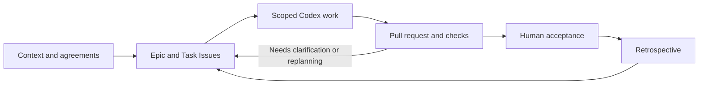

<p align="center">
  
</p>

<h1 align="center">Agentic Development Kit for Codex</h1>

<p align="center">
  <strong>GitHub-native, Human-on-the-Loop workflows for development with Codex.</strong>
</p>

<p align="center">
  <a href="https://github.com/mochan-tk/agentic-dev-kit-for-codex/actions/workflows/ci.yml"></a>
  <a href="LICENSE"></a>
</p>

<p align="center">
  <a href="#quick-start">Quick start</a> ·
  <a href="#how-it-works">How it works</a> ·
  <a href="#eight-skills-one-workflow">Skills</a> ·
  <a href="#safety-and-project-status">Safety and status</a> ·
  <a href="#documentation">Documentation</a>
</p>

Give Codex a repeatable way to prepare context, plan work, implement changes,
and return evidence. Keep plans and decisions in GitHub, rather than relying
on one conversation to remember everything.

Codex works inside a defined Task. Humans set direction, decide exceptions,
and retain agreement, acceptance, and merge authority. The kit supplies the
Skills, instructions, templates, and helpers for that workflow; it does not
replace your application, development tools, or delivery process.

Adapted from [Agentic Development Kit for GitHub Copilot](https://github.com/mochan-tk/agentic-dev-kit-for-copilot).
This edition uses Codex Skill and role files without assuming the Copilot app's
native session hierarchy or a complete autonomous runtime.

## Quick start

### 1. Install in your project

Use the root of an **existing Git repository** that no other agent or person
is changing concurrently. You do not need to clone this kit first.

| For | Prerequisites |
|---|---|
| macOS / Linux installation | Git, Bash 3.2+, curl, find, standard Unix utilities (including GNU/BSD `stat`), and `sha256sum` or `shasum` |
| Windows installation | PowerShell and Git for Windows, including Git Bash and its Unix utilities |
| GitHub-based development | A GitHub remote, a Codex client with access to your project, and authenticated `gh` plus `jq` for the GitHub helpers |

**macOS / Linux**

```sh
curl -fsSL https://raw.githubusercontent.com/mochan-tk/agentic-dev-kit-for-codex/main/.github/scripts/scaffold-init.sh | bash
```

**Windows PowerShell**

```powershell
irm https://raw.githubusercontent.com/mochan-tk/agentic-dev-kit-for-codex/main/.github/scripts/scaffold-init.ps1 | iex
```

Public kit acquisition needs no GitHub login; authenticated helpers are a later step.
The Windows entry uses Git Bash, not WSL. It has synthetic-test coverage;
native Windows installation has not been measured.

The installer resolves a source revision, validates the payload, installs it,
and stages only newly installed files. It preserves existing project-owned
files and refuses conflicting engine files or unsafe paths. It does **not**
create a Git repository, commit, push, configure GitHub, or start onboarding.

To preview without changing project files or the Git index:

```sh
curl -fsSL https://raw.githubusercontent.com/mochan-tk/agentic-dev-kit-for-codex/main/.github/scripts/scaffold-init.sh | bash -s -- --dry-run
```

These commands execute downloaded code. Review the source before trusting it.
For a fixed revision, caller-side `pipefail` to detect initial download failure,
PowerShell flags, or local-source installation, see the
[installation guide](docs/distribution/source-first-installer.md#one-command-first-installation).
If copying or staging fails, stop and review the reported partial state; do
not assume the installer has rolled it back.

### 2. Review and land the installation

Inspect the staged changes:

```sh
git diff --cached
```

Other changes may already have been staged before installation. Commit only
the adoption changes you have reviewed, and land them on the remote default
branch through your normal approval process. Do this before onboarding makes
GitHub changes.

Keep your project's existing README, AGENTS, CI, and other customizations.
If an existing `AGENTS.md` was preserved, explicitly connect the installed
`.github/codex-instructions.md` and Skills as described in the
[installed workflow guide](.github/distribution/payload/README.md).
Its no-staging description applies to the local source engine; the external
entry above stages new files. The public installation guide distinguishes both.

### 3. Onboard in Codex

Before invoking the Skill, open or select the adopter checkout in Codex—
**your project**, not this kit's repository. In the CLI or IDE extension,
explicitly mention the installed Skill (the
[official Skill invocation guide](https://developers.openai.com/codex/skills/)
also documents `/skills` selection):

```text
$project-onboarding
```

When your client does not expose that invocation, use this explicit fallback:

```text
Read and follow .agents/skills/project-onboarding/SKILL.md in this project.
```

Confirm it reads the installed file, not the kit-development Skill. This is
an explicit handoff, not a guarantee of automatic discovery on every client.

Onboarding inventories the project, verifies its existing commands, tunes
project instructions, and prepares an evidence-bearing onboarding PR and
planning handoff. It does not implement your application's next feature.
Review the PR, resolve or record deferred work, and accept onboarding before
moving on to ordinary development.

After the reviewed installation reaches the remote default branch, onboarding
runs canonical label setup and, when you supply a goal or material, drafts
phase Epic Issues for your review.
Those GitHub writes are distinct from optional Ruleset setup. Choose Enable
now, Create disabled, or Skip explicitly; the write choices require a reviewed
profile and separate consent. Skip performs no Ruleset operation.
The installer itself creates neither CI workflows nor branch protection. See the [onboarding Skill](.github/distribution/payload/.agents/skills/project-onboarding/SKILL.md).

### 4. Complete one small Task

Start with a change you can easily review. For example:

```text
Use the installed kit workflow to add CSV export to the existing report page.

Inspect the code first. Propose the acceptance criteria, owned files,
verification commands, and Task plan. Ask me to resolve unclear requirements.
After the plan is agreed, implement and test the change, then open a PR
with the results and any remaining concerns. Leave the merge decision to me.
```

Review the Task, diff, and evidence—not only the final chat message. Accept,
redirect, or reject the result. Use the retrospective workflow when repeated
friction suggests a reusable improvement.

### 5. Update explicitly when you choose

You do not need a kit clone. Supply the full 40-character commit IDs for the
version previously installed (`FROM`) and the reviewed new version (`TO`).
Use the previous installation's recorded `source-commit` or accepted adoption
record for `FROM`; if it is unknown, inspect that record before updating.
Choose a **new recovery directory outside your project**, with an existing
parent. Run from your project root; keep exclusive ownership during the update.

```sh
FROM=FULL_OLD_COMMIT_SHA
TO=FULL_NEW_COMMIT_SHA
RECOVERY=/path/to/new-private-recovery
set -o pipefail
curl -fsSL https://raw.githubusercontent.com/mochan-tk/agentic-dev-kit-for-codex/main/.github/scripts/scaffold-update.sh | bash -s -- --from "$FROM" --to "$TO" --recovery "$RECOVERY"
```

The default previews the update without changing project files, the index, or
the requested recovery directory. Apply that explicit update with:

```sh
curl -fsSL https://raw.githubusercontent.com/mochan-tk/agentic-dev-kit-for-codex/main/.github/scripts/scaffold-update.sh | bash -s -- --from "$FROM" --to "$TO" --recovery "$RECOVERY" --apply
```

PowerShell with Git Bash uses the same inputs and default preview:

```powershell
$From = 'FULL_OLD_COMMIT_SHA'
$To = 'FULL_NEW_COMMIT_SHA'
$Recovery = 'D:\private-recovery\new-update'
& ([scriptblock]::Create((irm https://raw.githubusercontent.com/mochan-tk/agentic-dev-kit-for-codex/main/.github/scripts/scaffold-update.ps1))) --from $From --to $To --recovery $Recovery
& ([scriptblock]::Create((irm https://raw.githubusercontent.com/mochan-tk/agentic-dev-kit-for-codex/main/.github/scripts/scaffold-update.ps1))) --from $From --to $To --recovery $Recovery --apply
```

Known-old engine files update; tuned instructions, instance records, existing
seed files and unrelated work are preserved. Unknown engine edits refuse the
whole update. Nothing is staged, committed or pushed. Keep the private recovery
directory at its original location, including after a failed apply. See
[offline rollback and fixed-entry selection](docs/distribution/source-first-installer.md#one-command-explicit-update)
before changing or deleting retained recovery inputs. Native Windows remains
unmeasured; updates are explicit and do not detect installed versions.

### 6. Check the project without cloning the kit

Use the [fixed-revision companion commands](docs/distribution/companion-checks.md)
to observe GitHub governance, check a planned worktree action, or validate
connector definitions. Choose the check and supply your actual inputs; each
Bash command downloads the complete unchanged helper, verifies its recorded
SHA-256, and runs it without installing extra files into your project.

Governance uses your existing authenticated `gh` for GET-only observations;
the other checks are local after downloading. No command repairs settings,
claims ownership, activates connectors or grants permission to push. Missing
evidence remains non-success. A successful check is not runtime qualification.

## How it works

GitHub is the durable work record. Codex sessions carry out the work; they do
not replace the Issue graph or the human decision to accept a result.



This diagram describes the workflow, not a guaranteed native session tree.
Use the tools actually available in the selected Codex client, or an explicit
handoff based on the committed files and GitHub records.

| Responsibility | Focus |
|---|---|
| Human owner | Intent, priorities, risk decisions, agreements, acceptance, and merge |
| Project / Epic coordination | The Issue graph, dependencies, next actionable Tasks, and replanning |
| Task supervision | Scope, plan, one active writer, verification, and escalation |
| Implementation worker | One scoped change, tests, commits, and evidence for a pull request |

The three shipped role definitions provide instructions. They do not establish
authenticated identities or guarantee native role selection. A GitHub Projects
board is optional; the Issue graph remains authoritative.

### Human-on-the-Loop by design

Routine, scoped work can proceed under the agreed plan without asking a human
to approve every edit. Ambiguity, high risk, scope changes, and insufficient
evidence return to human judgment. Agreement and merge authority stay with
the owner.

Four habits make that practical: record decisions before reporting them,
verify before claiming completion, keep one writer per owned scope, and
escalate rather than guess. Planned handoffs preserve the current Task,
plan, and committed checkpoint; they are not automatic crash recovery.

## Eight Skills, one workflow

These links show the **payload installed in your project**. Contributor
instructions for this kit are in [AGENTS.md](AGENTS.md).

| Skill | Use it to |
|---|---|
| [project-onboarding](.github/distribution/payload/.agents/skills/project-onboarding/SKILL.md) | Discover the project, verify its commands, and prepare its onboarding PR |
| [context-collection](.github/distribution/payload/.agents/skills/context-collection/SKILL.md) | Collect source material with provenance, or explicitly start builtin drafting |
| [context-distillation](.github/distribution/payload/.agents/skills/context-distillation/SKILL.md) | Propose durable requirements and decisions for human review |
| [plan-management](.github/distribution/payload/.agents/skills/plan-management/SKILL.md) | Build Epic / Task Issues and identify actionable work |
| [task-routing](.github/distribution/payload/.agents/skills/task-routing/SKILL.md) | Choose a suitable execution path for the bounded Task |
| [session-orchestration](.github/distribution/payload/.agents/skills/session-orchestration/SKILL.md) | Coordinate supervision, implementation, replanning, and handoffs |
| [verification](.github/distribution/payload/.agents/skills/verification/SKILL.md) | Check the diff, test results, and current records against acceptance criteria |
| [retro](.github/distribution/payload/.agents/skills/retro/SKILL.md) | Turn supported recurring problems into reviewed improvement proposals |

Use the Skill needed for the current step; do not restart onboarding for each
Task. Collected material and draft requirements are not automatically accepted
project truth. Distillation and review are separate decisions.

## Safety and project status

The kit is a workflow scaffold with explicit evidence and human gates—not an
autonomous service or a guarantee that generated code is correct.

| Boundary | What to expect |
|---|---|
| Existing project assets | Installation preserves project-owned content and stops on unsafe conflicts |
| Updates and recovery | Explicit old/new commit IDs support a one-command update with preserved customizations and retained offline operation rollback; no automatic or whole-repository recovery |
| Governance helpers | Reads report missing evidence as non-success; setup writes require separate, explicit authority |
| Feedback and retro | Reporting is consent-gated; retrospective proposals do not approve or retire controls automatically |
| Codex compatibility | Evidence is specific to the observed client and invocation path; cross-client parity and universal automatic Skill discovery are not promised |
| Product and release | A source-first workflow kit with bounded product tests; native Windows and cross-client runtime parity remain unmeasured |

The explicit governance, worktree and connector companions can run from a
reviewed kit checkout or the [verified no-clone commands](docs/distribution/companion-checks.md).
They are not additional files installed by the one-command entry. The
consent-gated failure reporter still uses a reviewed checkout. See the
[helper and procedure guide](docs/distribution/source-first-installer.md#governance-worktree-and-retro-procedures).

This repository has a clean product Git history and preserves the accepted
predecessor's 47-file payload and installer engine. See
[product scope](docs/product-scope.md) and [known limitations](docs/known-limitations.md)
for current behavior and evidence boundaries. Earlier acceptance, research and
unfinished runtime/release work remain in the [predecessor records](docs/provenance.md).

## Documentation

| You want to… | Read |
|---|---|
| Install, select a revision, update, or recover an operation | [Installation guide](docs/distribution/source-first-installer.md) |
| Check governance, worktrees or connector definitions without a kit clone | [Read-only companion commands](docs/distribution/companion-checks.md) |
| Understand the installed instructions and workflow | [Installed workflow guide](.github/distribution/payload/README.md) and [installed AGENTS](.github/distribution/payload/AGENTS.md) |
| Understand Issue-graph authority | [Installed instructions](.github/distribution/payload/AGENTS.md) |
| Check evidence boundaries and compatibility limits | [Known limitations](docs/known-limitations.md) |
| Inspect the shipped scope | [Product scope](docs/product-scope.md) |
| Inspect earlier acceptance and development history | [Source provenance](docs/provenance.md) |
| Run checks or contribute to the kit | [Contributing](CONTRIBUTING.md) and [contributor instructions](AGENTS.md) |

## Contributing

Use a bounded Task with a recorded plan, explicit file ownership, and evidence
for the change. Preserve existing safeguards, add relevant regression tests,
and leave acceptance and merge decisions to the owner.

Start with [CONTRIBUTING.md](CONTRIBUTING.md) and this repository's
[AGENTS.md](AGENTS.md). These instructions govern contributions to the kit.

A contributor quick check, from this kit's checkout:

```sh
python3 -I .github/scripts/check-product.py
python3 -I .github/scripts/check-installer.py
git diff --check
```

These are a starting subset; use the [full validation instructions](CONTRIBUTING.md#local-validation).
Product CI runs quality and conformance checks without predecessor history or
old Issue retrieval. Pinned lint-tool acquisition is a separate CI network step.

## Attribution and license

This project adapts [Agentic Development Kit for GitHub Copilot](https://github.com/mochan-tk/agentic-dev-kit-for-copilot).
The frozen behavioral source and target adaptations are recorded in
[source parity](.github/distribution/source-parity.v1.json).
The logo is reused from that same frozen source revision; it is an external
reference, not a claim of OpenAI endorsement.

Licensed under the [MIT License](LICENSE). Your application's license remains
yours; installing the kit does not replace it.
